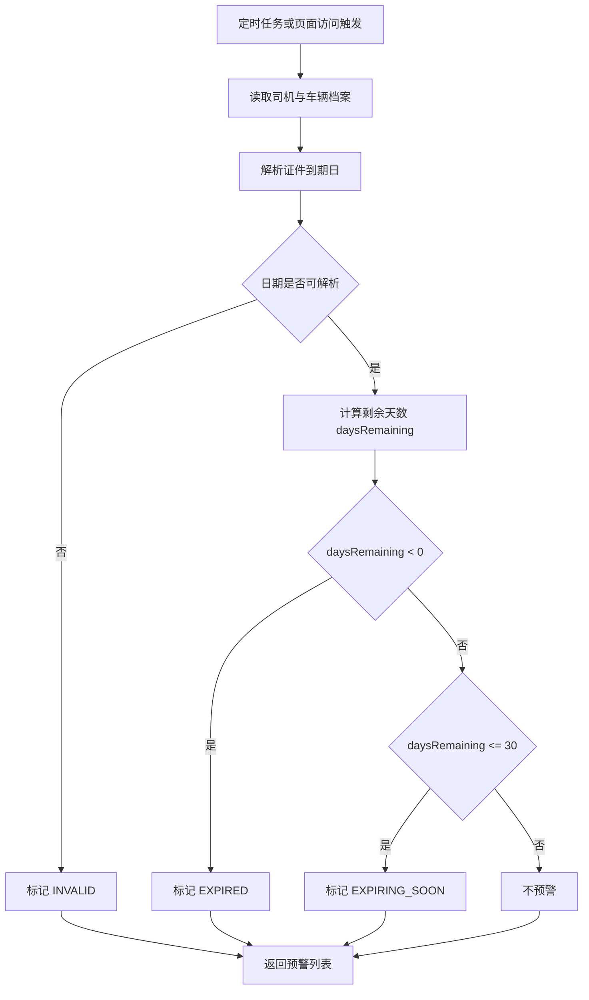
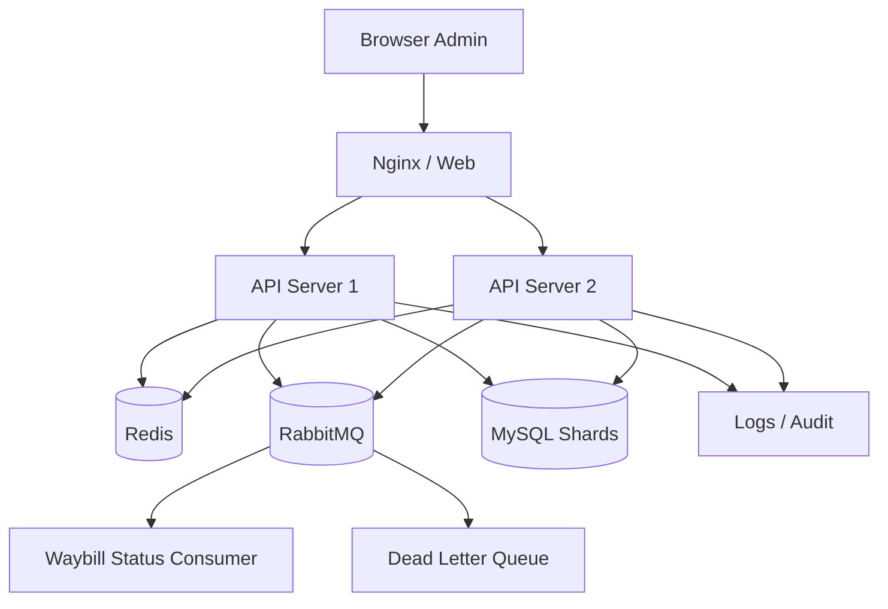
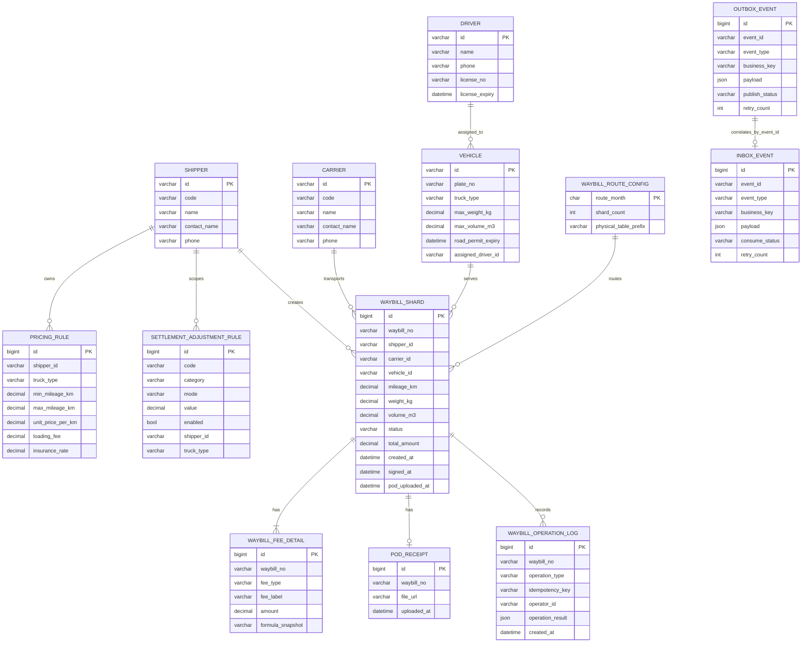

# 内部运单 & 结算管理后台设计方案

## 1. 目标范围

系统面向三类角色：货主、承运商、管理员。

覆盖范围：

- 基础档案管理：货主、承运商、车辆、司机
- 运单全流程：创建、分配、提货、在途、签收、回单上传
- 结算中心：阶梯运价、附加费用、补贴、扣款
- 预警中心：证件临期、过期、非法日期
- 运营报表：运单量、营收、承运商毛利
- 平台能力：Google 登录、RBAC、幂等、分表、MQ、缓存、Docker

## 2. 业务流程图

### 2.1 运单全流程


代码对应：

- 运单创建入口：`apps/api/src/index.ts` 中 `POST /api/waybills`
- 运费计算与容量校验：`apps/api/src/logic.ts` 中 `calculateFees`、`validateCapacity`、`buildSplitPlan`
- DB 分表写入：`apps/api/src/waybill-repository.ts` 中 `createWaybillInDb`、`importWaybillChunkInDb`
- MQ 发布与 outbox：`apps/api/src/mq.ts` 中 `publishWaybillEvent`、`flushOutbox`
- 签收 / 回单上传：`apps/api/src/index.ts` 中 `POST /api/waybills/:id/sign`、`POST /api/waybills/:id/upload-pod`

### 2.2 档案预警流程



代码对应：

- 预警计算：`apps/api/src/logic.ts` 中 `buildDocumentWarnings`
- 页面读取：`apps/api/src/index.ts` 中 `GET /api/warnings`
- 前端联合展示：`apps/web/src/App.tsx` 中 warnings 与 vehicle/driver 行合并逻辑

### 2.3 运费计算流程

```mermaid
flowchart LR
  A[输入草稿: 里程 车型 补贴 扣款] --> B[匹配运价规则]
  B --> C[计算干线运费: mileage x unitPrice]
  C --> D[计算装卸费: rule.loadingFee + extraLoadingFee]
  D --> E[计算保险费: lineHaul x insuranceRate]
  E --> F[写入补贴与扣款项]
  F --> G[汇总 totalAmount]
  G --> H[生成费用明细 fees[]]
  H --> I[返回总价与分项公式快照]
```

代码对应：

- 主计算流程：`apps/api/src/logic.ts` 中 `calculateFees`
- 规则匹配：`apps/api/src/logic.ts` 中 `findRule`
- 配置化附加规则：`apps/api/src/logic.ts` 中 `shouldApplyAdjustmentRule`、`resolveAdjustmentAmount`
- 规则存取：`apps/api/src/waybill-repository.ts` 中 `listPricingRulesFromDb`、`listSettlementAdjustmentRulesFromDb`

## 3. 架构图



## 4. ER 图



ER 说明：

- 物理分表实际为 `waybill_yyyyMM_n` 多张表，图中用 `WAYBILL_SHARD` 作为统一逻辑实体表示。
- `waybill_fee_detail`、`pod_receipt`、`waybill_operation_log` 当前都通过 `waybill_no` 关联运单，而不是 `waybill.id`。
- 当前运行态上传回单主流程已落库 `waybill_yyyyMM_n.pod_uploaded_at` 与状态 `POD_UPLOADED`；`pod_receipt` 表已在 SQL 中建好，用于正式文件地址持久化扩展。
- `pricing_rule` 与 `settlement_adjustment_rule` 虽不在本次验收必选实体名单内，但它们直接决定运费计算链路，所以一并放入 ER 图方便对应代码实现。

## 5. 核心业务设计

### 5.1 运费计算

总费用公式：

$$
总费用 = 干线运费 + 装卸费 + 保险费 + 补贴 - 扣款
$$

其中：

- 干线运费 = 里程 × 阶梯单价
- 装卸费 = 配置装卸费 + 临时装卸费
- 保险费 = 干线运费 × 保费率
- 补贴允许为负数
- 扣款统一以负值写入费用明细

设计要点：

- 每一项费用单独存储在运单费用明细表，保证可追溯
- 金额使用 decimal(18,2)
- 结算规则放入配置表，不把规则写死在核心流程中
- 运行态支持规则微调接口：`GET /api/pricing-rules`、`POST /api/pricing-rules`、`POST /api/pricing-rules/reload`

结算逻辑与业务配置解耦：

- 核心计算主流程固定为：`lineHaul -> loading -> insurance -> subsidy -> deduction -> total`，由 `calculateFees` 统一编排；
- 阶梯运价通过 `pricing_rule`（或内存规则镜像）驱动，不在主流程中写死 shipper/车型/区间分支；
- 业务临时项（新增装卸费项、新增扣款类型）通过配置化结算附加规则驱动：`GET /api/settlement-adjustments`、`POST /api/settlement-adjustments`；
- 计算引擎仅按规则元数据解释执行（类别/模式/值/启用状态/适用范围），新增业务项不需要改计算主流程代码。

微调生效示例（验收实测）：

- 调整 301-2000km 单价：`7.6 -> 8.1` 后，quote 干线费用自动更新（2660 -> 2835）；
- 新增装卸附加项（固定 +30）后，loading 汇总自动变化（230 -> 260）；
- 新增扣款类型（固定 -20）后，deduction 汇总自动变化（0 -> -20）；
- 新建运单自动继承最新规则，总价与 quote 保持一致（无需改核心计算主流程）。

### 5.2 运单容量校验

规则：重量和体积双约束，任一超标即拦截。

拆分建议公式：

$$
建议拆分数 = ceil(max(
  货物重量 / 车辆最大载重,
  货物体积 / 车辆最大体积
))
$$

### 5.3 幂等设计

幂等覆盖接口：

- 创建运单
- 签收
- 上传电子回单

实现策略：

- 请求头携带 x-idempotency-key
- Redis 记录请求键与结果快照：`idem:{key}`
- 数据库唯一索引兜底：`waybill_operation_log(waybill_no, operation_type)`
- 数据库唯一键防重复请求：`waybill_operation_log(idempotency_key)`
- 批量导入按“每一行一个 idempotencyKey”处理，重复行按已成功导入视为幂等命中，不拖垮整个 chunk

代码对应：

- 请求幂等快照：`apps/api/src/redis-cache.ts` 中 `getIdempotencySnapshot` / `setIdempotencySnapshot`
- 开单 / 签收 / 回单幂等入口：`apps/api/src/index.ts`
- DB 兜底唯一约束：`db/init/01_schema.sql` 中 `waybill_operation_log`
- 批量导入按行幂等：`apps/api/src/waybill-repository.ts` 中 `findExistingCreateIdempotencyKeys`、`importWaybillChunkInDb`

### 5.4 RabbitMQ 可靠消息

实现策略：

- 生产端：confirm 模式 + 持久化消息
- 消费端：手动 ack
- 重复消费：消费幂等表或 Redis 标记
- 异常消息：进入死信队列 DLQ
- 重试：普通队列 -> 重试队列 -> DLQ

当前落地细节：

- 交换机/队列全部 durable；消息发布设置 `deliveryMode=2`；发布后 `waitForConfirms` 确认；
- 队列拓扑：
  - 主队列 `waybill.events.q`（绑定主交换机）；
  - 重试队列 `waybill.events.retry.q`（`x-message-ttl` 到期回流主交换机）；
  - 死信队列 `waybill.events.dlq`（主队列消费失败或重试耗尽后进入）；
- 消费重试阈值：`x-retry-count >= 3` 进入死信；
- 去重与可追溯：
  - `inbox_event` 以 `event_id` 唯一约束做消费去重，避免分布式多实例重复执行；
  - `outbox_event` 持久化发布状态（NEW/FAILED/PUBLISHED），MQ 异常时可补偿重放；
- 运行态观测：`GET /api/mq/status`、`POST /api/mq/outbox/flush`。

代码对应：

- 生产 / confirm / outbox：`apps/api/src/mq.ts` 中 `publishWaybillEvent`、`publishToExchange`、`upsertOutboxEvent`
- 消费去重 / 重试 / 死信：`apps/api/src/mq.ts` 中 `tryRecordInboxEvent`、`handleMessage`、`routeToRetry`
- 状态接口：`apps/api/src/index.ts` 中 `/api/mq/status`、`/api/mq/outbox/flush`

### 5.5 分表设计

建议采用按月 + hash 的双层规则：

- 月度维度：waybill_202607
- hash 维度：waybill_202607_0 ~ waybill_202607_3

路由规则：

$$
目标表 = waybill_{yyyyMM}_{hash(waybillNo) \bmod 4}
$$

优点：

- 新增运单写入均衡
- 便于按月份归档
- 后续可扩展到 8、16 张表

跨分片查询：

- 报表使用汇总表或离线聚合表
- 明细查询按运单号直接路由
- 分页查询优先按时间范围缩小命中分表范围

分片扩容与数据迁移方案：

1. 扩容准备：

- 新建目标分片表（例如从 4 扩到 8，提前创建 waybill_yyyyMM_4 ~ waybill_yyyyMM_7）；
- 保持表结构与索引与旧分片完全一致；
- 在 waybill_route_config 中新增或更新 route_month 对应 shard_count。

2. 扩容切换策略：

- 新月切换（推荐）：仅对新月份生效 shard_count=8，历史月份保留 shard_count=4，不做在线搬迁；
- 当月在线扩容（可选）：采用灰度双写 + 分批回填 + 校验后切读。

3. 当月在线扩容步骤：

- 第一步：写路径开启双写（旧分片 + 新分片）；
- 第二步：按主键区间分批回填历史数据到新分片；
- 第三步：做行数校验、金额汇总校验、抽样明细校验；
- 第四步：切换读路由到新 shard_count；
- 第五步：观察稳定后下线旧写入，保留回滚窗口。

4. 回滚方案：

- 切换异常时，将 route_month 的 shard_count 回退到旧值；
- 保留双写期间操作日志，按 operation_log 进行补偿重放；
- 回滚后继续从旧分片提供读写服务。

## 6. 缓存设计

Redis 使用场景：

- shipper:detail:{id}（档案详情缓存，建议 TTL 30min）
- carrier:detail:{id}（档案详情缓存，建议 TTL 30min）
- vehicle:detail:{id}（档案详情缓存，建议 TTL 30min）
- lock:create-waybill:{shipperId}:{vehicleId}（分布式并发锁，已落地）
- idem:{key}（幂等结果快照缓存，已落地，TTL 24h）
- cache:bootstrap:v1（基础字典/权限/状态流缓存，已落地，TTL 30min）
- cache:dashboard:v1（首页统计热点缓存，已落地，TTL 20s）
- cache:waybills:recent:50（运单列表热点缓存，已落地，TTL 15s）
- cache:bootstrap:v1 在档案与结算规则 CRUD 后主动失效，避免页面读取旧规则

策略：

- 档案更新时主动删除缓存（当前已实现写操作后失效 dashboard/waybills 热点缓存）
- 结算规则更新时主动删除 `cache:bootstrap:v1`
- 热点报表短 TTL 缓存
- 分布式锁设置过期时间，避免死锁
- 对空值缓存短 TTL，防穿透

接口观测与验收：

- `GET /api/bootstrap`、`GET /api/dashboard`、`GET /api/waybills` 响应头返回 `x-cache-hit`（1=命中，0=未命中）
- `GET /api/cache/status` 返回关键缓存键是否存在
- 任意写接口（开单/签收/回单）成功后，主动失效 `cache:dashboard:v1` 与 `cache:waybills:recent:50`
- 档案详情缓存接口：
  - `GET /api/archives/shippers/:id` -> `shipper:detail:{id}`（TTL 30min）
  - `GET /api/archives/carriers/:id` -> `carrier:detail:{id}`（TTL 30min）
  - `GET /api/archives/vehicles/:id` -> `vehicle:detail:{id}`（TTL 30min）
- 档案新增/修改接口（当前为内存示例）会主动失效对应详情缓存与 `cache:bootstrap:v1`：
- 结算规则新增/修改/删除接口会主动失效 `cache:bootstrap:v1`：
  - `POST /api/pricing-rules`
  - `DELETE /api/pricing-rules/:id`
  - `POST /api/settlement-adjustments`
  - `DELETE /api/settlement-adjustments/:id`

代码对应：

- 缓存基础能力：`apps/api/src/redis-cache.ts` 中 `rememberJson`、`rememberJsonNullable`、`cacheDelete`
- 页面热点缓存：`apps/api/src/index.ts` 中 `/api/bootstrap`、`/api/dashboard`、`/api/waybills`
- 规则 / 档案写后失效：`apps/api/src/index.ts`
  - `POST/PUT /api/archives/shippers...`
  - `POST/PUT /api/archives/carriers...`
  - `POST/PUT /api/archives/vehicles...`

## 7. 索引设计

核心索引建议：

- waybill(waybill_no) unique
- waybill(shipper_id, created_at desc)
- waybill(carrier_id, created_at desc)
- waybill(status, created_at desc)
- vehicle(plate_no)
- driver(phone)
- driver(license_no)
- pod_receipt(waybill_id) unique
- waybill_operation_log(waybill_id, operation_type) unique

分页与报表补充索引（已落地到 SQL 脚本）：

- waybill_yyyyMM_n(created_at, id)
- waybill_yyyyMM_n(shipper_id, created_at, id)
- waybill_yyyyMM_n(carrier_id, created_at, id)
- waybill_yyyyMM_n(vehicle_id, status, created_at)
- waybill_fee_detail(waybill_no, fee_type)
- waybill_fee_detail(fee_type, created_at)
- pod_receipt(uploaded_at)
- waybill_operation_log(created_at)
- waybill_report_daily(report_date, shipper_id, carrier_id) unique
- waybill_report_daily(carrier_id, report_date)
- waybill_report_daily(shipper_id, report_date)

慢查询验证：

- 执行 `db/init/05_slow_query_validation.sql`，通过 `EXPLAIN` 检查关键 SQL 命中索引；
- 分页使用 `(created_at, id)` 组合游标避免深分页回表退化；
- 报表场景优先查询 `waybill_report_daily` 聚合表，降低跨分片实时聚合成本。

## 8. 权限模型

角色定义：

- 货主：开单、看自己运单、看结算
- 承运商：看承运运单、上传回单、看毛利
- 管理员：全量管理、档案维护、规则维护、报表与监控

Google 登录流程：

1. 前端跳转 Google OAuth2
2. 网关或应用接收 code
3. 服务端换取用户信息
4. 按邮箱或组织映射内部角色
5. 生成 JWT / Session

## 9. 部署方案

### 9.1 单机部署

- Nginx：静态前端 + API 反向代理
- API：2 个实例
- Redis：1 个实例
- RabbitMQ：1 个实例
- MySQL：主从或单实例

本仓库提供的 docker compose 采用 gateway + web + api-1 + api-2 + mysql + redis + rabbitmq 的形式，在一台服务器上模拟分布式部署结构。

### 9.2 分布式部署

- Server A：Nginx + API-1 + Redis Sentinel-1
- Server B：Nginx + API-2 + Redis Sentinel-2
- Server C：RabbitMQ Cluster Node-1 + MySQL 主库
- Server D：RabbitMQ Cluster Node-2 + MySQL 从库 / 分片库

能力要求：

- 任意一台 API 服务器宕机，另一台继续接流量
- RabbitMQ 镜像队列或 quorum queue
- Redis 高可用哨兵
- Nginx upstream 健康检查

当前已落地（代码与配置）：

- `docker-compose.yml`：`api-1` / `api-2` 双实例、`restart: unless-stopped`、API 健康检查
- `infra/nginx/gateway.conf`：`max_fails` + `fail_timeout` + `proxy_next_upstream` 自动重试切换
- `apps/api/src/index.ts`：`x-instance-id` 响应头、`GET /api/ha/instance` 实例诊断接口

故障转移演练结果（2026-07-06）：

- 双实例运行时，经网关访问 `/health` 可轮询命中 `api-1` 与 `api-2`
- 手工下线 `api-1` 后，连续 8 次请求均返回 `200`
- 8 次请求均由 `api-2` 承接（`x-gateway-upstream=api-2`，`instanceId=api-2`）

结论：已具备“单台服务器宕机，另一台继续提供服务”的故障自动转移能力。

代码 / 配置对应：

- 网关：`infra/nginx/gateway.conf`
- 双实例编排：`docker-compose.yml`
- 分布式示例部署：`deploy/distributed/server1/docker-compose.yml`、`deploy/distributed/server2/docker-compose.yml`
- 实例诊断：`apps/api/src/index.ts` 中 `GET /api/ha/instance`

## 10. 自测方案

### 10.1 功能边界

- 零里程
- 零运费
- 负数补贴
- 空运单
- 超重 / 超体积
- 重复签收
- 重复回单上传
- 证件空白
- 非法日期

### 10.2 性能压测

- 批量导入 10000 条运单：流式读取 + 分批插入
- 50~200 并发开单：Redis 锁 + 幂等键 + DB 唯一约束
- 报表查询：百万数据分页 5 秒内返回

### 10.3 故障演练

- 关闭 RabbitMQ 队列，验证重试与死信
- 手工注入错误费用数据，验证日志排查链路
- 关闭一台 API 服务器，验证另一台继续可用

### 10.4 日志留存

- API 关键链路日志按天写入 `apps/api/logs/api-YYYY-MM-DD.log`

## 11. 文档与代码对应关系

为保证“图文齐全且能对应代码实现”，关键设计与代码映射如下：

| 设计项 | 文档位置 | 代码 / 配置位置 |
| --- | --- | --- |
| 运单全流程图 | 第 2.1 节 | `apps/api/src/index.ts`、`apps/api/src/logic.ts`、`apps/api/src/waybill-repository.ts` |
| 档案预警流程图 | 第 2.2 节 | `apps/api/src/logic.ts` 中 `buildDocumentWarnings` |
| 运费计算流程图 | 第 2.3 节 | `apps/api/src/logic.ts` 中 `calculateFees` |
| ER 图 | 第 4 节 | `db/init/01_schema.sql`、`apps/api/src/domain.ts` |
| 分表方案 | 第 5.5 节 | `apps/api/src/logic.ts` 中 `resolveShardTable`、`apps/api/src/waybill-repository.ts` |
| MQ 架构 | 第 3 节、第 5.4 节 | `apps/api/src/mq.ts`、`apps/api/src/index.ts` |
| 幂等 | 第 5.3 节 | `apps/api/src/index.ts`、`apps/api/src/redis-cache.ts`、`db/init/01_schema.sql` |
| 分布式锁 | 第 6 节 | `apps/api/src/redis-lock.ts`、`apps/api/src/index.ts` |
| 缓存 | 第 6 节 | `apps/api/src/redis-cache.ts`、`apps/api/src/index.ts` |
| 部署方案 | 第 9 节 | `docker-compose.yml`、`infra/nginx/gateway.conf`、`deploy/distributed/server1/docker-compose.yml`、`deploy/distributed/server2/docker-compose.yml` |
| 日志与排障 | 第 10 节 | `apps/api/src/logger.ts`、`apps/api/logs/*.log`、`docs/logs/*.md` |

## 12. 当前代码实现与扩展边界

当前仓库提供的是可运行验收版基础：

- 已实现后台界面、运费计算、容量校验、证件预警、结算规则 CRUD、幂等示例、分表路由示例
- 已实现 RabbitMQ 基础链路（confirm 发布、重试队列、死信队列、消费端 eventId 去重、outbox 重发接口）
- 已提供 Docker Compose 双实例编排、网关故障切换配置与系统设计文档

若继续做成正式验收版本，下一步应补齐：

1. `pod_receipt.file_url` 的真实文件存储接入（当前表结构已预留）
2. Google OAuth2 生产级凭证与组织目录对接
3. 分片扩容自动化迁移脚本与灰度回切工具
4. 更完整的自动化集成测试矩阵与持续压测基线
